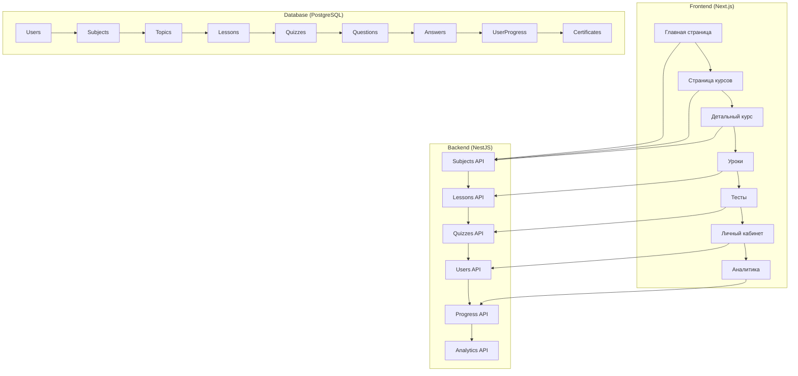

# Детальный план реализации образовательной платформы

## Общая архитектура проекта



## Этапы реализации

### Этап 1: Подготовка и настройка (1-2 недели)

#### 1.1 Установка зависимостей
```bash
# Frontend
cd frontend
npm install framer-motion react-intersection-observer three @react-three/fiber recharts locomotive-scroll

# Backend
cd backend
npm install @nestjs/typeorm typeorm pg
```

#### 1.2 Настройка Tailwind CSS v4
```typescript
// frontend/tailwind.config.mjs
export default {
  darkMode: ["class"],
  content: [
    './src/app/**/*.{ts,tsx}',
    './src/components/**/*.{ts,tsx}',
    './src/lib/**/*.{ts,tsx}',
    './src/middleware.ts',
  ],
  theme: {
    extend: {
      colors: {
        primary: {
          50: '#eff6ff',
          100: '#dbeafe',
          200: '#bfdbfe',
          300: '#93c5fd',
          400: '#60a5fa',
          500: '#3b82f6',
          600: '#2563eb',
          700: '#1d4ed8',
          800: '#1e40af',
          900: '#1e3a8a',
        },
        accent: {
          50: '#fdf4ff',
          100: '#fae8ff',
          200: '#f5d0fe',
          300: '#f0abfc',
          400: '#e879f9',
          500: '#d946ef',
          600: '#c026d3',
          700: '#a21caf',
          800: '#86198f',
          900: '#701a75',
        }
      }
    }
  }
}
```

#### 1.3 Создание базовых компонентов
```typescript
// frontend/src/components/ui/glass-card.tsx
import { motion } from 'framer-motion'
import { cn } from '@/lib/utils'

interface GlassCardProps {
  children: React.ReactNode
  className?: string
}

export function GlassCard({ children, className = '' }: GlassCardProps) {
  return (
    <motion.div
      className={cn(
        'relative bg-white/10 dark:bg-black/10',
        'border border-white/20 dark:border-white/10',
        'rounded-2xl p-6 backdrop-blur-md',
        className
      )}
      whileHover={{ y: -4 }}
      transition={{ duration: 0.3 }}
    >
      {children}
    </motion.div>
  )
}
```

### Этап 2: Улучшение главной страницы (2-3 недели)

#### 2.1 Параллакс эффект для Hero секции
```typescript
// frontend/src/components/home/hero-parallax.tsx
import { motion, useScroll, useTransform } from 'framer-motion'
import { useRef } from 'react'

export function HeroParallax() {
  const ref = useRef<HTMLDivElement>(null)
  const { scrollYProgress } = useScroll({
    target: ref,
    offset: ['start end', 'end start']
  })
  
  const y = useTransform(scrollYProgress, [0, 1], ['20%', '-20%'])
  const opacity = useTransform(scrollYProgress, [0, 0.2, 0.8, 1], [0, 1, 1, 0])
  
  return (
    <div ref={ref} className="relative h-screen overflow-hidden">
      <motion.div
        style={{ y, opacity }}
        className="absolute inset-0 bg-gradient-to-br from-blue-600 via-purple-600 to-pink-600"
      />
      <ParticleBackground />
    </div>
  )
}
```

#### 2.2 Интерактивные карточки курсов
```typescript
// frontend/src/components/home/featured-courses.tsx
import { motion } from 'framer-motion'
import { Card3D } from '@/components/parallax/3d-card'

export function FeaturedCourses() {
  const courses = [
    {
      id: '1',
      title: 'Охрана труда',
      description: 'Комплексный курс по основам охраны труда',
      progress: 75,
      lessons: 12,
      duration: '8 часов'
    }
  ]
  
  return (
    <div className="grid grid-cols-1 md:grid-cols-2 lg:grid-cols-3 gap-8">
      {courses.map((course, index) => (
        <motion.div
          key={course.id}
          initial={{ opacity: 0, y: 50 }}
          animate={{ opacity: 1, y: 0 }}
          transition={{ delay: index * 0.1 }}
        >
          <Card3D className="h-full">
            <GlassCard>
              <CourseCard course={course} />
            </GlassCard>
          </Card3D>
        </motion.div>
      ))}
    </div>
  )
}
```

### Этап 3: Страница курсов (2-3 недели)

#### 3.1 Улучшенная страница курсов
```typescript
// frontend/src/app/(main)/subjects/page.tsx
import { motion } from 'framer-motion'
import { ScrollReveal } from '@/components/animations/scroll-reveal'

export default function SubjectsPage() {
  return (
    <div className="container mx-auto px-4 py-8">
      <ScrollReveal delay={0.2}>
        <motion.h1 
          className="text-4xl font-bold mb-8"
          initial={{ opacity: 0, y: 30 }}
          animate={{ opacity: 1, y: 0 }}
        >
          Все курсы
        </motion.h1>
      </ScrollReveal>
      
      <div className="grid grid-cols-1 md:grid-cols-2 lg:grid-cols-3 gap-8">
        {subjects.map((subject, index) => (
          <ScrollReveal key={subject.id} delay={0.1 * index}>
            <SubjectCard subject={subject} />
          </ScrollReveal>
        ))}
      </div>
    </div>
  )
}
```

#### 3.2 Карточка курса с анимациями
```typescript
// frontend/src/components/subjects/subject-card-animated.tsx
import { motion } from 'framer-motion'
import { Progress } from '@/components/ui/progress'
import { Badge } from '@/components/ui/badge'

export function SubjectCardAnimated({ subject }: SubjectCardProps) {
  return (
    <motion.div
      whileHover={{ y: -8 }}
      className="group relative overflow-hidden rounded-xl border bg-card shadow-lg transition-all duration-300 hover:shadow-2xl"
    >
      <div className="absolute inset-0 bg-gradient-to-br from-blue-500/10 to-purple-500/10" />
      
      <Card className="relative">
        <CardHeader className="flex-row items-center gap-4">
          <div className="flex size-12 items-center justify-center rounded-lg bg-gradient-to-br from-blue-500 to-purple-600">
            <BookOpen className="size-6 text-white" />
          </div>
          <div>
            <CardTitle className="text-lg font-semibold group-hover:text-blue-600 transition-colors">
              {subject.title}
            </CardTitle>
            <div className="flex items-center gap-2 mt-1">
              <Badge variant="secondary">Охрана труда</Badge>
              <span className="text-sm text-muted-foreground">12 уроков</span>
            </div>
          </div>
        </CardHeader>
        
        <CardContent className="space-y-4">
          <Progress value={75} className="h-2" />
          <p className="text-sm text-muted-foreground line-clamp-3">
            {getDescription(subject.description)}
          </p>
        </CardContent>
        
        <CardFooter>
          <Button asChild className="w-full group-hover:bg-blue-600">
            <Link href={`/subjects/${subject.id}`}>
              Продолжить обучение
              <ArrowRight className="ml-2 size-4" />
            </Link>
          </Button>
        </CardFooter>
      </Card>
    </motion.div>
  )
}
```

### Этап 4: Детальный просмотр курса (3-4 недели)

#### 4.1 Таймлайн курса
```typescript
// frontend/src/components/subjects/timeline.tsx
import { motion } from 'framer-motion'
import { CheckCircle, Circle, Clock } from 'lucide-react'

interface TimelineProps {
  topics: Topic[]
  completedLessons: string[]
}

export function Timeline({ topics, completedLessons }: TimelineProps) {
  return (
    <div className="relative">
      <div className="absolute left-8 top-0 h-full w-0.5 bg-gradient-to-b from-blue-500 to-purple-500" />
      
      {topics.map((topic, index) => (
        <motion.div
          key={topic.id}
          initial={{ opacity: 0, x: -50 }}
          animate={{ opacity: 1, x: 0 }}
          transition={{ delay: index * 0.1 }}
          className="relative flex items-center gap-8 mb-8"
        >
          <div className="flex size-16 items-center justify-center rounded-full bg-white border-4 border-blue-500 z-10">
            {index === 0 ? (
              <CheckCircle className="size-6 text-blue-500" />
            ) : (
              <Circle className="size-6 text-gray-400" />
            )}
          </div>
          
          <div className="flex-1">
            <h3 className="text-lg font-semibold">{topic.title}</h3>
            <p className="text-sm text-muted-foreground">
              {topic.lessons?.length || 0} уроков
            </p>
            
            <div className="mt-2 space-y-1">
              {topic.lessons?.map((lesson) => (
                <div
                  key={lesson.id}
                  className={`flex items-center gap-2 text-sm ${
                    completedLessons.includes(lesson.id)
                      ? 'text-green-600'
                      : 'text-muted-foreground'
                  }`}
                >
                  {completedLessons.includes(lesson.id) ? (
                    <CheckCircle className="size-4" />
                  ) : (
                    <Circle className="size-4" />
                  )}
                  <span>{lesson.title}</span>
                  <Clock className="size-3 ml-auto" />
                </div>
              ))}
            </div>
          </div>
        </motion.div>
      ))}
    </div>
  )
}
```

#### 4.2 Страница детального курса
```typescript
// frontend/src/app/(main)/subjects/[subjectId]/page.tsx
import { motion } from 'framer-motion'
import { Timeline } from '@/components/subjects/timeline'
import { LearningProgress } from '@/components/progress/learning-progress'

export default function SubjectPage({ params }: { params: Promise<{ subjectId: string }> }) {
  const { subjectId } = React.use(params)
  
  return (
    <div className="container mx-auto px-4 py-8">
      <motion.div
        initial={{ opacity: 0, y: 30 }}
        animate={{ opacity: 1, y: 0 }}
        transition={{ duration: 0.6 }}
      >
        <SubjectDetails subjectId={subjectId} />
      </motion.div>
      
      <motion.div
        initial={{ opacity: 0, y: 30 }}
        animate={{ opacity: 1, y: 0 }}
        transition={{ duration: 0.6, delay: 0.2 }}
        className="mt-12"
      >
        <LearningProgress 
          totalLessons={totalLessons}
          completedLessons={completedLessons}
          currentTopic={currentTopic}
        />
      </motion.div>
      
      <motion.div
        initial={{ opacity: 0, y: 30 }}
        animate={{ opacity: 1, y: 0 }}
        transition={{ duration: 0.6, delay: 0.4 }}
        className="mt-12"
      >
        <Timeline 
          topics={subject.topics}
          completedLessons={completedLessons}
        />
      </motion.div>
    </div>
  )
}
```

### Этап 5: Улучшение страницы урока (2-3 недели)

#### 5.1 Интерактивная страница урока
```typescript
// frontend/src/app/(main)/lessons/[lessonId]/page.tsx
import { motion } from 'framer-motion'
import { LessonNavigation } from '@/components/lesson/navigation'
import { LessonContent } from '@/components/lesson/content'
import { FloatingProgress } from '@/components/lesson/floating-progress'

export default function LessonPage({ params }: { params: Promise<{ lessonId: string }> }) {
  const { lessonId } = React.use(params)
  
  return (
    <div className="min-h-screen bg-gradient-to-br from-blue-50 via-white to-purple-50">
      <div className="flex">
        {/* Боковая навигация */}
        <LessonNavigation lessons={lessons} currentLessonId={lessonId} />
        
        {/* Основной контент */}
        <div className="flex-1">
          <motion.div
            initial={{ opacity: 0, y: 30 }}
            animate={{ opacity: 1, y: 0 }}
            transition={{ duration: 0.6 }}
          >
            <LessonContent lesson={lesson} />
          </motion.div>
          
          <motion.div
            initial={{ opacity: 0, y: 30 }}
            animate={{ opacity: 1, y: 0 }}
            transition={{ duration: 0.6, delay: 0.2 }}
          >
            <LessonActions lesson={lesson} />
          </motion.div>
        </div>
      </div>
      
      <FloatingProgress progress={progress} />
    </div>
  )
}
```

#### 5.2 Улучшенный контент урока
```typescript
// frontend/src/components/lesson/content.tsx
import { motion } from 'framer-motion'
import { ScrollReveal } from '@/components/animations/scroll-reveal'

interface LessonContentProps {
  lesson: Lesson
}

export function LessonContent({ lesson }: LessonContentProps) {
  return (
    <div className="max-w-4xl mx-auto p-6">
      {/* Заголовок урока */}
      <ScrollReveal>
        <motion.div
          initial={{ opacity: 0, y: 30 }}
          animate={{ opacity: 1, y: 0 }}
          className="mb-8"
        >
          <div className="flex items-center gap-4 mb-4">
            <Badge variant="outline">{lesson.difficulty}/5</Badge>
            <span className="text-sm text-muted-foreground">
              ~{lesson.estimatedTime} мин
            </span>
          </div>
          
          <h1 className="text-4xl font-bold mb-4">{lesson.title}</h1>
          
          {lesson.learningObjectives && (
            <div className="bg-blue-50 dark:bg-blue-950/20 rounded-lg p-4 mb-6">
              <h3 className="font-semibold mb-2">Цели обучения:</h3>
              <ul className="list-disc list-inside space-y-1 text-sm">
                {lesson.learningObjectives.split('\n').map((objective, index) => (
                  <li key={index}>{objective}</li>
                ))}
              </ul>
            </div>
          )}
        </motion.div>
      </ScrollReveal>
      
      {/* Контент урока */}
      <ScrollReveal delay={0.2}>
        <motion.div
          initial={{ opacity: 0, y: 30 }}
          animate={{ opacity: 1, y: 0 }}
          className="prose prose-lg max-w-none"
        >
          <div dangerouslySetInnerHTML={{ __html: lesson.content }} />
        </motion.div>
      </ScrollReveal>
      
      {/* Вложения */}
      {lesson.attachments && lesson.attachments.length > 0 && (
        <ScrollReveal delay={0.4}>
          <motion.div
            initial={{ opacity: 0, y: 30 }}
            animate={{ opacity: 1, y: 0 }}
            className="mt-8"
          >
            <h3 className="text-lg font-semibold mb-4">Материалы для скачивания:</h3>
            <div className="grid grid-cols-1 md:grid-cols-2 gap-4">
              {lesson.attachments.map((attachment, index) => (
                <AttachmentCard key={index} attachment={attachment} />
              ))}
            </div>
          </motion.div>
        </ScrollReveal>
      )}
    </div>
  )
}
```

### Этап 6: Улучшенный интерфейс тестов (2-3 недели)

#### 6.1 Анимированный тест
```typescript
// frontend/src/app/(main)/lessons/[lessonId]/quiz/page.tsx
import { motion, AnimatePresence } from 'framer-motion'
import { QuestionNavigation } from '@/components/quiz/navigation'
import { Timer } from '@/components/quiz/timer'

export default function QuizPage({ params }: { params: Promise<{ lessonId: string }> }) {
  const { lessonId } = React.use(params)
  
  return (
    <div className="max-w-4xl mx-auto p-6">
      {/* Заголовок теста */}
      <motion.div
        initial={{ opacity: 0, y: 30 }}
        animate={{ opacity: 1, y: 0 }}
        className="mb-8"
      >
        <QuizHeader quiz={quiz} timeRemaining={timeRemaining} />
      </motion.div>
      
      {/* Прогресс теста */}
      <motion.div
        initial={{ opacity: 0, y: 30 }}
        animate={{ opacity: 1, y: 0 }}
        transition={{ delay: 0.2 }}
        className="mb-8"
      >
        <Progress value={progress} className="h-3" />
        <p className="text-sm text-muted-foreground mt-2">
          Вопрос {currentQuestion} из {totalQuestions}
        </p>
      </motion.div>
      
      {/* Вопросы с анимациями */}
      <AnimatePresence mode="wait">
        <motion.div
          key={currentQuestionIndex}
          initial={{ opacity: 0, x: 50 }}
          animate={{ opacity: 1, x: 0 }}
          exit={{ opacity: 0, x: -50 }}
          transition={{ duration: 0.3 }}
        >
          <QuestionCard question={currentQuestion} />
        </motion.div>
      </AnimatePresence>
      
      {/* Навигация */}
      <QuestionNavigation questions={quiz.questions} currentQuestion={currentQuestion} />
    </div>
  )
}
```

#### 6.2 Компонент вопроса
```typescript
// frontend/src/components/quiz/question-card.tsx
import { motion } from 'framer-motion'
import { RadioGroup, RadioGroupItem } from '@/components/ui/radio-group'
import { Checkbox } from '@/components/ui/checkbox'
import { Label } from '@/components/ui/label'

interface QuestionCardProps {
  question: Question
  selectedAnswers: Record<string, string[]>
  onAnswerChange: (questionId: string, answerId: string, checked: boolean) => void
}

export function QuestionCard({ question, selectedAnswers, onAnswerChange }: QuestionCardProps) {
  return (
    <motion.div
      initial={{ opacity: 0, y: 20 }}
      animate={{ opacity: 1, y: 0 }}
      transition={{ duration: 0.3 }}
      className="space-y-6"
    >
      <div className="flex items-start gap-4">
        <div className="flex size-8 items-center justify-center rounded-full bg-blue-100 text-blue-600 font-semibold">
          {question.text.charAt(0)}
        </div>
        <div className="flex-1">
          <h3 className="text-lg font-semibold mb-4">{question.text}</h3>
          
          {question.type === 'SINGLE_CHOICE' ? (
            <RadioGroup
              value={selectedAnswers[question.id]?.[0] || ''}
              onValueChange={(value) => onAnswerChange(question.id, value, true)}
            >
              {question.answers.map((answer) => (
                <div key={answer.id} className="flex items-center space-x-2">
                  <RadioGroupItem value={answer.id} id={answer.id} />
                  <Label htmlFor={answer.id}>{answer.text}</Label>
                </div>
              ))}
            </RadioGroup>
          ) : (
            <div className="space-y-2">
              {question.answers.map((answer) => (
                <div key={answer.id} className="flex items-center space-x-2">
                  <Checkbox
                    id={answer.id}
                    checked={selectedAnswers[question.id]?.includes(answer.id) || false}
                    onCheckedChange={(checked) => onAnswerChange(question.id, answer.id, !!checked)}
                  />
                  <Label htmlFor={answer.id}>{answer.text}</Label>
                </div>
              ))}
            </div>
          )}
        </div>
      </div>
    </motion.div>
  )
}
```

### Этап 7: Личный кабинет и аналитика (2-3 недели)

#### 7.1 Улучшенный Dashboard
```typescript
// frontend/src/app/(main)/dashboard/page.tsx
import { motion } from 'framer-motion'
import { LearningStatsCard } from '@/components/dashboard/stats-card'
import { ActiveCourses } from '@/components/dashboard/active-courses'
import { Recommendations } from '@/components/dashboard/recommendations'

export default function DashboardPage() {
  return (
    <div className="space-y-8">
      {/* Приветственный блок */}
      <motion.div
        initial={{ opacity: 0, y: 30 }}
        animate={{ opacity: 1, y: 0 }}
        transition={{ duration: 0.6 }}
      >
        <WelcomeSection user={user} />
      </motion.div>
      
      {/* Статистика обучения */}
      <motion.div
        initial={{ opacity: 0, y: 30 }}
        animate={{ opacity: 1, y: 0 }}
        transition={{ duration: 0.6, delay: 0.2 }}
        className="grid grid-cols-1 md:grid-cols-2 lg:grid-cols-4 gap-6"
      >
        <LearningStatsCard 
          title="Пройдено уроков"
          value={completedLessons}
          total={totalLessons}
          icon={BookOpen}
        />
        <TimeSpentCard timeSpent={timeSpent} />
        <AchievementsCard achievements={achievements} />
        <CurrentCourseCard currentCourse={currentCourse} />
      </motion.div>
      
      {/* Активные курсы */}
      <motion.div
        initial={{ opacity: 0, y: 30 }}
        animate={{ opacity: 1, y: 0 }}
        transition={{ duration: 0.6, delay: 0.4 }}
      >
        <ActiveCoursesSection courses={activeCourses} />
      </motion.div>
      
      {/* Рекомендации */}
      <motion.div
        initial={{ opacity: 0, y: 30 }}
        animate={{ opacity: 1, y: 0 }}
        transition={{ duration: 0.6, delay: 0.6 }}
      >
        <RecommendationsSection recommendations={recommendations} />
      </motion.div>
    </div>
  )
}
```

#### 7.2 Графики прогресса
```typescript
// frontend/src/components/dashboard/progress-chart.tsx
import { BarChart, Bar, XAxis, YAxis, CartesianGrid, Tooltip, ResponsiveContainer } from 'recharts'

interface ProgressChartProps {
  data: Array<{
    name: string
    progress: number
  }>
}

export function ProgressChart({ data }: ProgressChartProps) {
  return (
    <div className="h-64">
      <ResponsiveContainer width="100%" height="100%">
        <BarChart data={data}>
          <CartesianGrid strokeDasharray="3 3" />
          <XAxis dataKey="name" />
          <YAxis />
          <Tooltip />
          <Bar dataKey="progress" fill="#3b82f6" />
        </BarChart>
      </ResponsiveContainer>
    </div>
  )
}
```

### Этап 8: Тестирование и оптимизация (1-2 недели)

#### 8.1 Unit тесты
```typescript
// frontend/src/components/__tests__/subject-card.test.tsx
import { render, screen } from '@testing-library/react'
import { SubjectCard } from '@/components/subjects/subject-card'
import { mockSubject } from '@/__mocks__/data'

describe('SubjectCard', () => {
  it('renders subject title and description', () => {
    render(<SubjectCard subject={mockSubject} />)
    
    expect(screen.getByText(mockSubject.title)).toBeInTheDocument()
    expect(screen.getByText(mockSubject.description)).toBeInTheDocument()
  })
  
  it('has navigation link to subject details', () => {
    render(<SubjectCard subject={mockSubject} />)
    
    const link = screen.getByRole('link')
    expect(link).toHaveAttribute('href', `/subjects/${mockSubject.id}`)
  })
})
```

#### 8.2 E2E тесты
```typescript
// frontend/tests/e2e/learning-flow.spec.ts
import { test, expect } from '@playwright/test'

test.describe('Learning Flow', () => {
  test('user can complete a lesson and quiz', async ({ page }) => {
    // Вход в систему
    await page.goto('/auth/login')
    await page.fill('[data-testid="email"]', 'test@example.com')
    await page.fill('[data-testid="password"]', 'password123')
    await page.click('[data-testid="login-button"]')
    
    // Переход к курсу
    await page.click('[data-testid="courses-link"]')
    await page.click('[data-testid="course-card"]')
    
    // Начало урока
    await page.click('[data-testid="lesson-link"]')
    expect(page.locator('[data-testid="lesson-content"]')).toBeVisible()
    
    // Завершение урока
    await page.click('[data-testid="complete-lesson-button"]')
    
    // Прохождение теста
    await page.click('[data-testid="quiz-button"]')
    await page.fill('[data-testid="quiz-answer"]', 'correct answer')
    await page.click('[data-testid="submit-quiz-button"]')
    
    // Проверка результата
    expect(page.locator('[data-testid="quiz-result"]')).toBeVisible()
  })
})
```

#### 8.3 Оптимизация производительности
```typescript
// frontend/src/lib/performance.ts
export const optimizeImages = () => {
  // Ленивая загрузка изображений
  const images = document.querySelectorAll('img[data-src]')
  const imageObserver = new IntersectionObserver((entries) => {
    entries.forEach(entry => {
      if (entry.isIntersecting) {
        const img = entry.target as HTMLImageElement
        img.src = img.dataset.src!
        imageObserver.unobserve(img)
      }
    })
  })
  
  images.forEach(img => imageObserver.observe(img))
}

export const preloadCriticalResources = () => {
  // Предзагрузка критических ресурсов
  const criticalResources = [
    '/fonts/inter.woff2',
    '/styles/main.css'
  ]
  
  criticalResources.forEach(resource => {
    const link = document.createElement('link')
    link.rel = 'preload'
    link.href = resource
    link.as = resource.includes('.css') ? 'style' : 'font'
    document.head.appendChild(link)
  })
}
```

## Сроки реализации

| Этап | Затраты времени | Результат |
|------|----------------|----------|
| Этап 1: Подготовка | 1-2 недели | Настроен стек, базовые компоненты |
| Этап 2: Главная страница | 2-3 недели | Параллакс эффект, интерактивные карточки |
| Этап 3: Страница курсов | 2-3 недели | Улучшенный UI, таймлайн |
| Этап 4: Детальный курс | 3-4 недели | Полная реализация курса с прогрессом |
| Этап 5: Уроки | 2-3 недели | Интерактивные уроки с материалами |
| Этап 6: Тесты | 2-3 недели | Анимированный интерфейс тестов |
| Этап 7: Dashboard | 2-3 недели | Аналитика, графики, рекомендации |
| Этап 8: Тестирование | 1-2 недели | Полное тестирование, оптимизация |
| **Итого** | **17-25 недель** | **Готовая платформа** |

## Риски и решения

### 1. Технические риски
- **Риск**: Сложная анимация влияет на производительность
- **Решение**: Использование `will-change`, `transform` вместо `top/left`

### 2. Сроки
- **Риск**: Задержки из-за сложных компонентов
- **Решение**: Итеративная разработка, MVP версия сначала

### 3. Качество
- **Риск**: Баги из-за сложной анимации
- **Решение**: Тестирование на каждом этапе, Code Review

## Метрики успеха

1. **Производительность**: 
   - Lighthouse score > 90
   - First Contentful Paint < 1.5s
   - Largest Contentful Paint < 2.5s

2. **Пользовательский опыт**:
   - Time on Page > 3 минуты
   - Completion Rate > 70%
   - User satisfaction > 4.5/5

3. **Технические метрики**:
   - Test coverage > 80%
   - Bundle size < 1MB
   - No critical errors in production